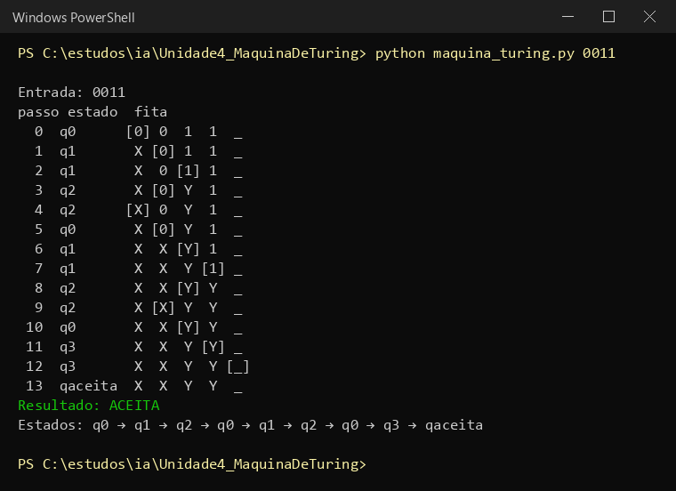
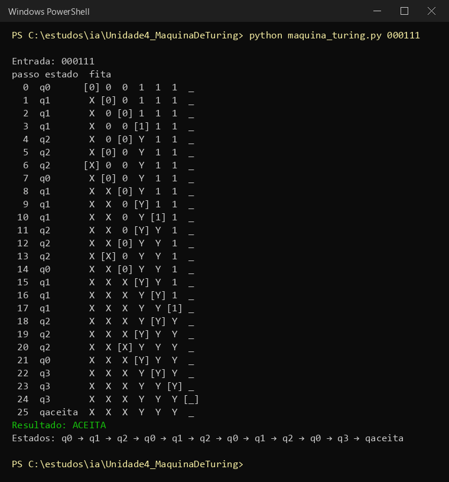
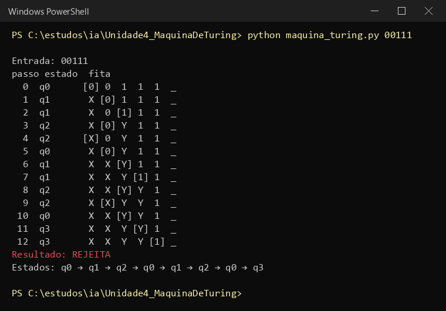

# Atividade 5 - Máquinas de Turing

Atividade remota da aula 09. Vale 1,0 ponto. Copiei cada pergunta antes de responder, como nos
outros arquivos.

O simulador que eu usei foi um programa meu em Python: [maquina_turing.py](maquina_turing.py). As
capturas das execuções estão na pasta [capturas](capturas).

---

## Etapa 1 - Introdução

### 1. O que é uma Máquina de Turing?

É um modelo matemático de computador que o Alan Turing criou em 1936. Não é uma máquina física, é
uma ideia: uma fita infinita dividida em células, uma cabeça que lê e escreve um símbolo por vez e
anda para esquerda ou direita, e uma tabela de regras que diz o que fazer em cada situação.

Com essas peças simples dá pra executar qualquer algoritmo. Por isso ela virou a definição do que é
"computar".

### 2. Quais são os principais componentes de uma Máquina de Turing?

```
fita          infinita, dividida em células; guarda a entrada, os rascunhos e a saída
cabeça        lê o símbolo da célula atual, escreve outro e anda uma casa (E ou D)
estados       um conjunto finito; tem o inicial e os de parada (aceita / rejeita)
alfabeto      os símbolos que podem ser escritos na fita, incluindo o branco
transições    as regras: (estado, símbolo lido) -> (símbolo escrito, movimento, próximo estado)
```

### 3. Qual é a importância das Máquinas de Turing para a computação?

Ela deu uma definição exata do que é um algoritmo. Antes disso "procedimento mecânico" era uma
ideia vaga. Com a máquina dá pra provar coisas: o que um computador consegue fazer e o que ele nunca
vai conseguir, como o problema da parada.

Ela também é a base do computador moderno. Von Neumann pegou a ideia de uma máquina universal e
colocou programa e dados na mesma memória. Toda linguagem que a gente usa (Python, Java, C) é
"Turing completa", ou seja, faz o mesmo que uma Máquina de Turing.

### 4. Qual é a relação entre Máquina de Turing e algoritmo?

Um algoritmo é uma sequência finita de passos bem definidos. A Máquina de Turing é a forma
matemática de escrever isso: cada regra da tabela é um passo.

A ideia aceita na computação (tese de Church-Turing) é que tudo que dá pra resolver com um algoritmo
dá pra resolver com uma Máquina de Turing. Então, se não existe Máquina de Turing para um problema,
não existe algoritmo para ele.

---

## Etapa 2 - Simulação

Enunciado:

```
Crie uma máquina capaz de reconhecer palavras da forma 0ⁿ1ⁿ.
Aceitas: 01, 0011, 000111, 00001111
Rejeitadas: 0, 1, 001, 011, 00111
Desafio: verificar se existe a mesma quantidade de 0 e 1.
```

### A ideia

Não dá pra "contar" com um número, porque a máquina não tem variável. O jeito é riscar: a cada volta
eu risco um 0 e um 1. Se os dois acabarem juntos, a quantidade era igual.

```
0 riscado vira X
1 riscado vira Y
```

Exemplo com 0011:

```
0 0 1 1      começo
X 0 Y 1      primeira volta: riscou um 0 e um 1
X X Y Y      segunda volta: riscou mais um par
             não sobrou 0 nem 1 -> ACEITA
```

### Estados

```
q0        começo da volta; procura o próximo 0 para riscar
q1        já riscou um 0; anda para a direita procurando o primeiro 1
q2        já riscou o 1; volta para a esquerda até achar o X
q3        acabaram os 0; confere se só tem Y até o fim
qaceita   parada com aceitação
```

### Tabela de transições

| Estado | Lê | Escreve | Move | Vai para |
|---|---|---|---|---|
| q0 | 0 | X | D | q1 |
| q0 | Y | Y | D | q3 |
| q1 | 0 | 0 | D | q1 |
| q1 | Y | Y | D | q1 |
| q1 | 1 | Y | E | q2 |
| q2 | 0 | 0 | E | q2 |
| q2 | Y | Y | E | q2 |
| q2 | X | X | D | q0 |
| q3 | Y | Y | D | q3 |
| q3 | _ | _ | D | qaceita |

O _ é o branco. Qualquer combinação que não está na tabela faz a máquina parar e REJEITAR. Por
exemplo, q3 lendo 1 quer dizer que sobrou 1 sem par, e q1 lendo branco quer dizer que sobrou 0 sem
par.

---

## Etapa 3 - Registro da simulação

| Teste | Entrada | Esperado | Obtido | Estados percorridos |
|---|---|---|---|---|
| 1 | 0011 | ACEITA | ACEITA | q0 → q1 → q2 → q0 → q1 → q2 → q0 → q3 → qaceita |
| 2 | 000111 | ACEITA | ACEITA | q0 → q1 → q2 → q0 → q1 → q2 → q0 → q1 → q2 → q0 → q3 → qaceita |
| 3 | 00111 | REJEITA | REJEITA | q0 → q1 → q2 → q0 → q1 → q2 → q0 → q3 (parou lendo 1) |

Nos estados percorridos eu juntei as repetições seguidas. O passo a passo completo, com a fita em
cada passo, está nas capturas.

### Teste 1 - 0011



Duas voltas de q0 → q1 → q2, uma para cada par. Na terceira vez em q0 ele lê Y, então não tem mais 0,
e vai para q3. q3 passa pelos Y, acha o branco e aceita. 13 passos.

### Teste 2 - 000111



Mesma coisa, só que com três voltas. 25 passos. Dá pra ver que cada 0 a mais aumenta bastante o
número de passos, porque a cabeça anda a fita inteira em cada volta.

### Teste 3 - 00111



Riscou os dois pares e foi para q3. Só que depois dos dois Y ainda tinha um 1. Não existe regra para
q3 lendo 1, então a máquina parou e rejeitou. Sobrou um 1 sem par, que é exatamente o que tinha que
dar.

### Testes que eu fiz a mais

Rodei também os outros exemplos do enunciado:

```
01         ACEITA
00001111   ACEITA
0          REJEITA   em q1 acha branco: sobrou 0 sem par
1          REJEITA   q0 lendo 1 não tem regra
001        REJEITA   em q1 acha branco na segunda volta
011        REJEITA   em q3 acha 1
```

Todos bateram com o esperado.

### Descrição da Máquina de Turing criada

A máquina reconhece 0ⁿ1ⁿ riscando um 0 e um 1 por volta. Em q0 ela risca o primeiro 0 (vira X) e
passa para q1, que anda para a direita pulando 0 e Y até achar o primeiro 1, que vira Y. Em q2 ela
volta para a esquerda até o X e recomeça em q0. Quando q0 encontra Y em vez de 0, acabaram os 0, e
q3 confere se até o branco só tem Y. Se tiver, aceita. Se aparecer um 0 ou 1 sobrando em qualquer
ponto, não tem regra e ela rejeita.

---

## Etapa 4 - Reflexão sobre os limites computacionais

Pergunta: Uma Máquina de Turing consegue resolver qualquer problema? Explique por que existem
problemas que não podem ser resolvidos por algoritmos.

Não. A Máquina de Turing consegue fazer tudo que um algoritmo consegue, mas existem problemas que
nenhum algoritmo resolve. O exemplo clássico é o problema da parada: saber, para qualquer programa e
qualquer entrada, se ele vai terminar ou rodar para sempre. Turing provou que isso é impossível. A
ideia da prova é que, se existisse esse "detector", dava pra construir um programa que pergunta ao
detector sobre si mesmo e faz o contrário da resposta, e aí o detector erraria de qualquer jeito.
Então o limite não é falta de memória ou de velocidade. Mesmo com fita infinita e tempo infinito,
esses problemas continuam sem solução, porque o próprio conceito de algoritmo não alcança eles.

---

## Questão final

Pergunta: Como saber se um problema é apenas difícil ou se não existe nenhum algoritmo capaz de
resolvê-lo para todos os casos?

Um problema difícil tem algoritmo, só que ele demora muito. Um exemplo é ordenar ou testar todas as
combinações de uma senha: é lento, mas eu sei que termina e dá a resposta certa. Isso é assunto de
complexidade (tempo, O(n²), O(2ⁿ)).

Um problema sem algoritmo (indecidível) é diferente: não existe Máquina de Turing que pare com a
resposta certa para todas as entradas. Para saber se é o caso, o caminho que a gente viu é a
redução: mostrar que, se eu conseguisse resolver o meu problema, eu também resolveria o problema da
parada. Como o da parada já é provado impossível, o meu também é.

Então, na prática:

```
consigo escrever uma máquina que sempre para com a resposta certa?   -> é computável (pode ser lento)
resolver ele resolveria o problema da parada?                        -> é indecidível
```

Testar e ver que "demora muito" não prova nada. Demorar é sinal de problema difícil, não de problema
impossível. A prova de que não existe algoritmo tem que ser feita no papel.

---

## Resumo

```
máquina        risca um 0 (X) e um 1 (Y) por volta; aceita se sobrar só X e Y
estados        q0, q1, q2, q3, qaceita
testes         0011 ACEITA, 000111 ACEITA, 00111 REJEITA; os três bateram
limite         problema da parada: provado que não existe algoritmo
difícil x      difícil tem algoritmo lento; indecidível não tem algoritmo nenhum
impossível
```
